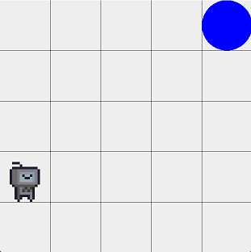
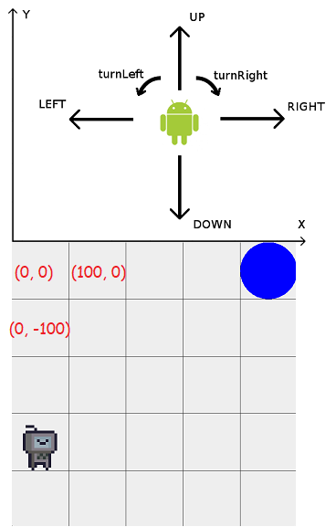

# Stepik robot

### Usage

1. Скачать код из репозитория
2. Вставить свою имплементацию метода `moveRobot(Robot robot, int toX, int toY)` в фалй [YouCodeHere.java](src/main/java/com/github/kzfor/stepik/robo/YourCodeHere.java)
3. Запустить gradle task run, варианты на выбор:
    1. Руками запустить `./gradlew run` (Linux) `.\gradlew.bat run` (Windows)
    2. Запустить при помощи IDE gradle -> application -> run

### Description  

Визуализация робота из задания на курсе "Java. Базовый курс" [Stepik](https://stepik.org/course/187/)  
Этот проект сделан только с целью визуализации готового решения и не адаптирован для написания с нуля.  
Тут поле находится в отрицательной зоне по оси Y, первая клетка (левая сверху) является началом координат.

